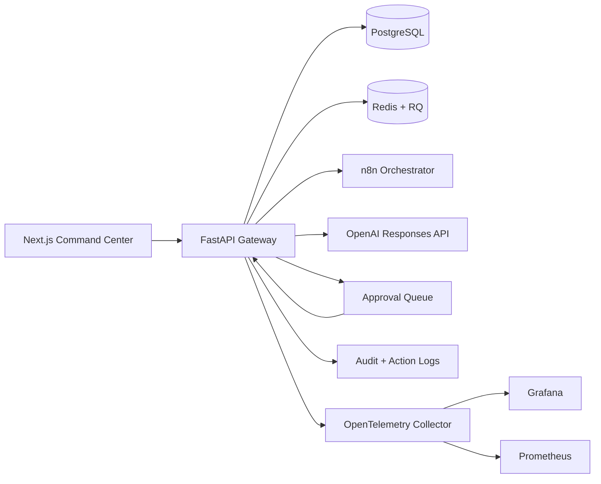
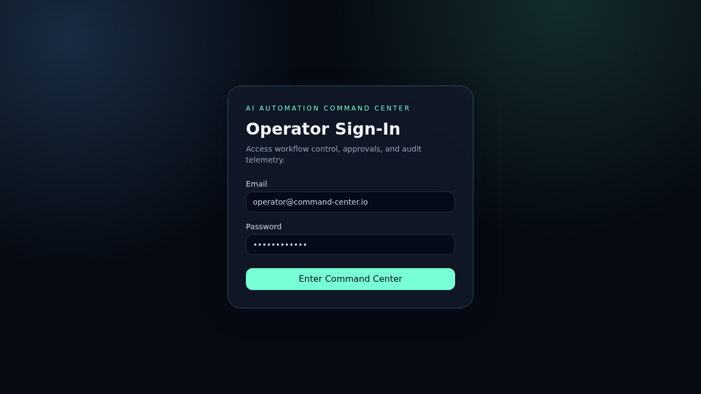
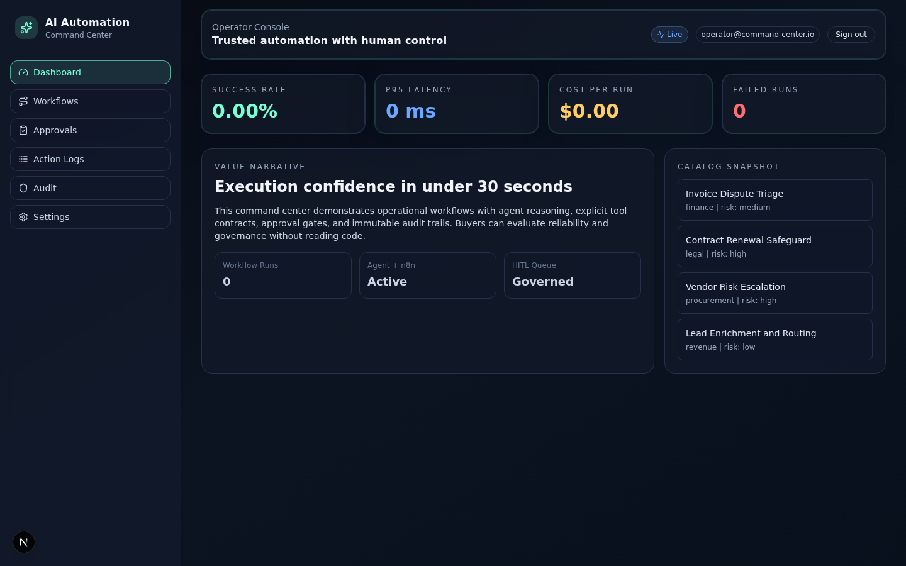
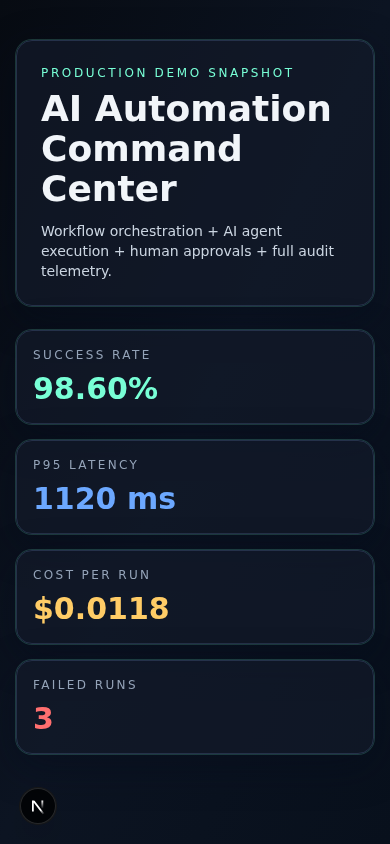

# AI Automation Command Center

Production-grade technical demo for enterprise operations teams.

This repository demonstrates how to combine **n8n orchestration**, **AI agents (OpenAI Responses tool-calling pattern)**, **human-in-the-loop approvals**, and **full auditability** in a buyer-ready command center experience.

## Phase 0 Stack Validation
Validated against official documentation and release sources (March 11, 2026).

| Layer | Chosen in Repo | Validation Source |
|---|---|---|
| Frontend framework | Next.js `15.5.6` + React `19.1.0` | Next.js support policy: https://nextjs.org/support-policy, React blog/releases: https://react.dev/blog |
| Language | TypeScript `5.9.x` | TypeScript release notes: https://www.typescriptlang.org/docs/handbook/release-notes/typescript-5-9.html |
| Styling | Tailwind CSS `3.4.x` + Motion (`framer-motion`) | Tailwind docs/releases: https://tailwindcss.com/docs/installation, Motion docs: https://motion.dev/docs |
| Backend gateway | FastAPI `0.135.x` | FastAPI release notes: https://fastapi.tiangolo.com/release-notes/ |
| Workflow engine | n8n self-hosted | n8n docs/releases: https://docs.n8n.io/ and https://github.com/n8n-io/n8n/releases |
| Data | PostgreSQL `17` | PostgreSQL docs: https://www.postgresql.org/docs/ |
| Cache / queue | Redis `7.4` + RQ | Redis docs: https://redis.io/docs/latest/ |
| Observability | OpenTelemetry + Prometheus + Grafana | OpenTelemetry docs: https://opentelemetry.io/docs/, Prometheus docs: https://prometheus.io/docs/, Grafana docs: https://grafana.com/docs/ |
| Packaging | Docker Compose | Compose docs: https://docs.docker.com/compose/ |
| CI/CD | GitHub Actions | GitHub Actions docs: https://docs.github.com/actions |

Note: Next.js 16.x is active LTS, but this repo is pinned to Next.js 15.5.6 for local Node 18 compatibility while preserving production-ready architecture.

## Product Scope (P0)
- Workflow catalog for business users
- Trigger ingestion via signed webhook + scheduler
- Agent task execution with structured input/output and tool contracts
- Human approval queue (approve/reject with reason)
- Action execution logs with redaction
- Audit timeline (who/what/when)
- KPI dashboard (success rate, p95 latency, cost per run, failed runs)
- Settings panel (secrets status, environment checks, safety controls)

## Architecture


## Core API Contract
- OpenAPI contract: [docs/api/openapi.json](docs/api/openapi.json)
- Main endpoints:
  - `POST /api/v1/auth/login`
  - `GET /api/v1/workflows/catalog`
  - `POST /api/v1/triggers/webhook/{workflow_slug}`
  - `POST /api/v1/triggers/scheduler/run`
  - `POST /api/v1/agent/execute`
  - `GET /api/v1/approvals/queue`
  - `POST /api/v1/approvals/{approval_id}/decision`
  - `GET /api/v1/logs/actions`
  - `GET /api/v1/audit/timeline`
  - `GET /api/v1/dashboard/kpis`
  - `GET /api/v1/settings`

## Local Run
### Option A: Full stack with Docker Compose
```bash
docker compose up -d --build
```

Services:
- Frontend: http://localhost:3000
- Backend API: http://localhost:8000
- n8n: http://localhost:5678
- Prometheus: http://localhost:9090
- Grafana: http://localhost:3001

### Option B: Local dev mode
```bash
# backend
cd backend
python3 -m venv .venv
. .venv/bin/activate
pip install -r requirements.txt -r requirements-dev.txt
uvicorn app.main:app --reload

# frontend
cd frontend
npm install
npm run dev
```

## Demo Credentials (seeded)
- `operator@command-center.io` / `ChangeMe!123`
- `admin@command-center.io` / `ChangeMe!123`

## Screenshots and Demo GIF

### Login


### Authenticated Dashboard


### Mobile Preview


### Demo GIF


## 7-Minute Client Walkthrough
- [docs/walkthrough-7-minutes.md](docs/walkthrough-7-minutes.md)

## Why This Reduces Delivery Risk
- **Explicit control points**: high-risk workflows pause for human approval.
- **Traceability by default**: action logs + audit timeline provide non-repudiation context.
- **Safety guardrails**: retries, timeout, budget thresholds, dead-letter path.
- **Provider abstraction**: OpenAI Responses integration is swappable; no hard lock-in.
- **Operational visibility**: KPI dashboard + Prometheus/Grafana wiring accelerates incident triage.
- **Production packaging**: Docker Compose, CI pipelines, and PR governance are included.

## Quality Gates Used
Backend:
```bash
cd backend
. .venv/bin/activate
pytest -q
ruff check .
mypy app
```

Frontend:
```bash
cd frontend
npm run lint
npm run typecheck
npm run test -- --run
npm run build
```

## Repository Workflow
Branch strategy and PR roadmap are documented in [docs/PR_ROADMAP.md](docs/PR_ROADMAP.md).

Conventional commits, PR template, and CI workflows are configured under `.github/`.
